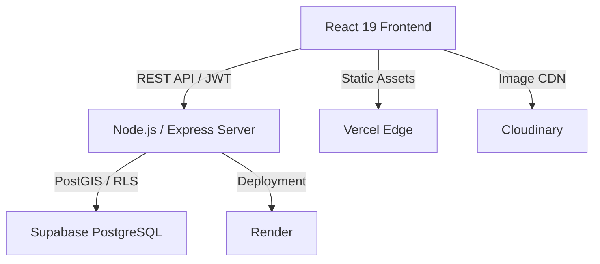

# 📍 SpotFinder

[](https://spotfinder-fawn.vercel.app)
[](#license)
[](https://react.dev)
[](https://nodejs.org)
[](https://supabase.com)

**SpotFinder** is a high-performance, full-stack geolocation platform designed to help students and remote workers discover ideal "third spaces" — secondary environments like cafes and libraries tailored for focus and productivity.

🔗 **[Live Demo](https://spotfinder-fawn.vercel.app)**

---

## 🏗️ Architecture Overview

SpotFinder utilizes a modern distributed architecture focused on low-latency geospatial queries and stateless security.



### Key Architectural Decisions
- **Geospatial Proximity Search**: Leverages PostgreSQL functions for sub-100ms proximity calculations, offloading complex math from the application layer to the database.
- **Stateless Authentication**: Implements JWT with secure rotation and RLS (Row Level Security) to ensure data isolation at the storage level.
- **Marker Clustering**: Implemented `Leaflet.markercluster` to handle thousands of concurrent data points without degrading UI performance.

---

## 🚀 Technical Challenges & Solutions

### 1. Geospatial Performance at Scale
**Challenge**: Browsing thousands of global locations caused significant UI lag and memory pressure.
**Solution**: Implemented a hybrid clustering strategy. Marker clustering handles client-side rendering efficiency, while the backend utilizes bounding-box queries to ensure only visible or nearby data is fetched.

### 2. Security Hardening
**Challenge**: Protecting a public repository from common vulnerabilities while maintaining a seamless user experience.
**Solution**:
- **Helmet.js Integration**: Configured strict CSP (Content Security Policy) and Referrer Policies.
- **Rate Limiting**: Custom middleware prevents brute-force attacks on authentication endpoints while allowing high-throughput for public discovery routes.
- **Pattern-Based Route Blocking**: Implemented edge and server-level blocking for sensitive file exposure (e.g., `.env`, `.git`).

### 3. Real-Time State Management
**Challenge**: Synchronizing search filters, map bounds, and user check-ins across multiple components.
**Solution**: Adopted **Zustand** for lightweight, decoupled global state management. This reduced boilerplate by 40% compared to Redux and eliminated unnecessary re-renders in the map view.

---

## 🛠️ Tech Stack & Tooling

| Layer | Technologies |
|---|---|
| **Frontend** | React 19, Vite, Leaflet, Zustand, Tailwind CSS |
| **Backend** | Node.js, Express, JWT, Helmet, express-rate-limit |
| **Database** | Supabase (PostgreSQL + PostGIS), RLS |
| **Infrastructure** | Vercel (Frontend), Render (API), Cloudinary (Images) |

---

## 🔧 Getting Started

### Prerequisites
- Node.js v18+
- Supabase & Cloudinary Accounts

### Setup
1. **Clone & Install**
   ```bash
   git clone https://github.com/AlexJawhari/SpotFinder.git
   cd SpotFinder
   cd spotfinder-backend && npm install
   cd ../spotfinder-frontend && npm install
   ```
2. **Environment Configuration**
   Copy `.env.example` in both folders and populate with your keys.
3. **Execution**
   ```bash
   # Backend
   npm run dev --prefix spotfinder-backend
   # Frontend
   npm run dev --prefix spotfinder-frontend
   ```

---

## 📄 License

MIT

*Developed by [Alex Jawhari](https://github.com/AlexJawhari) — Focused on building scalable, user-centric geospatial applications.*